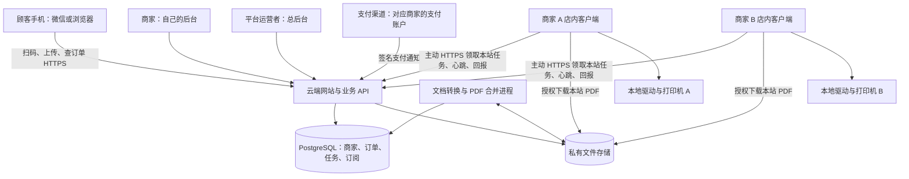

# 纸间 SaaS 商业版设计

设计日期：2026-09-15。本文是待实施方案，不代表当前版本已具备云端派单、真实收款或实体自动打印能力。

## 1. 产品结构与已确定的经营模式

采用「云端平台 + 商家后台 + 店内打印客户端 + 顾客扫码网页」架构。顾客打印费进入对应商家自己的支付商户账户；平台向商家收取软件服务费，两类交易分别记账，不设计平台归集打印费后再人工结算的流程。

第一版面向多商家、每商家可有多个门店、每门店可有多个打印站。先用两个不同商家的真实打印站试点，再按压测结果扩容。首版以 Windows 客户端和手机网页为主，小程序与 Linux 执行端后续接入同一云端接口。



云端不主动连接商家的本地端口。店内客户端主动向云端发出 HTTPS 请求，任务通过请求的响应交付；商家电脑不需要公网 IP、端口映射、内网穿透，也不用运行面向顾客的网站。顾客使用手机流量或任意可访问云端的网络即可。

## 2. 四个使用入口

| 使用者 | 入口 | 主要能力 |
| --- | --- | --- |
| 平台运营者 | 云端 `/platform` | 开通/停用商家、套餐与到期管理、门店和终端数、版本管理、全平台故障概览、支持操作审计 |
| 商家 | 云端 `/merchant` | 店铺名称、门店、员工权限、打印机配置、价格、支付账户接入、入口二维码、订单与异常处理、软件续费 |
| 顾客 | 云端 `/s/{stationCode}` | 查看店铺与可用状态、上传 Word/PDF/多图片、排序预览、付款、查看打印进度 |
| 店内电脑 | 可安装的 Windows 客户端 | 绑定商家和打印站、检测打印机、执行任务、恢复状态、显示连接异常、导出诊断日志 |

二维码指向固定的云端站点地址，例如 `https://print.example.com/s/某个公开站点码`。域名是占位示例。电脑换 IP 不需要换二维码；更换电脑则重新绑定客户端。站点码只定位打印站，不授予下载资料或查看其他顾客订单的权限。

总后台默认展示运营元数据，不默认开放顾客原文件。涉及代商家排障的访问需有独立权限、理由和审计记录。

## 3. 商家首次开通流程

1. 平台为商家创建租户、套餐、终端配额和初始管理员，或由商家注册后购买软件服务。
2. 商家在云端首次向导中填写店铺名称、门店地址、打印站名称。
3. 云端引导下载店内客户端，并生成短时、一次性的绑定码。客户端输入绑定码，商家确认绑定到指定门店和打印站。
4. 客户端检测本机已安装打印机并上传队列清单。云端显示「检测于某时间」和电脑在线状态。
5. 商家选择本站默认打印机。云端发送配置命令，客户端验证并保存后回执；只有收到成功回执，云端才显示配置成功。
6. 商家配置单面/双面价格、封页、资料保留时间，接入自己的支付商户账户。服务端校验支付配置状态。
7. 执行一次实体测试打印，核对 A4、黑白、双面、封页和多图片次序。虚拟打印机只能启用演示站，不能据此认定实体打印验收通过。
8. 完成一次手机扫码体验后开启正式接单，下载云端入口二维码贴在打印机旁。

向导进度按打印站保存，不再使用当前数据库中的全局单条初始化标记。软件服务到期、支付接入未完成、客户端离线或打印机故障，应分别显示原因。

## 4. 本地客户端如何领取云端任务

首版采用 HTTPS 长轮询：客户端发起等待任务请求，云端有任务时立即响应，没有任务时约 25 秒返回空结果，客户端再发下一次请求。它提供业务上的云端派单，同时保持网络连接由店内主动发起。后续可增加 WebSocket 通知加快唤醒，任务记录仍以数据库为准。

建议初始参数（上线前通过现场网络验证）：

- 每 15 秒心跳，超过 45 秒未收到心跳标记离线；每个打印站只允许一个活跃执行会话。
- 无网络时按指数退避并加入随机抖动，最大间隔 30 秒，避免所有终端同时重连。
- 每台实体打印机串行执行任务。首版每站固定一个默认队列，不在故障时自动切换到其他门店或打印机。
- 客户端使用 SQLite 持久化任务、下载校验值、执行尝试和系统作业编号，重启后先核对历史任务。
- 自动启动、进程异常重启、日志轮转和磁盘空间检查随安装程序配置；本地设置界面只对本机开放。

绑定码建议有效期 5 分钟、只能兑换一次，并限制猜测次数。每终端使用独立凭据，凭据绑定租户、门店和打印站，能够撤销与轮换。终端凭据不能访问其他站点的文件、支付密钥或管理接口。Windows 凭据使用系统保护存储，安装包内不放通用管理员密钥。

后台点击「检测打印机」会创建配置命令：离线时显示「等待电脑上线」，在线时客户端执行检测再回传结果。用户选择默认队列后同样必须等待客户端确认；不能只改云端字段就显示「连接成功」。新默认用于之后的任务，已经进入执行阶段的任务保持原队列绑定。

## 5. 一笔订单的完整流程

1. 顾客扫码，云端根据站点码确定租户、门店和打印站。展示店名、价格、接单状态。
2. 上传到私有文件存储，云端转换进程完成格式校验、页数识别、Word 转 PDF、图片整理与预览。
3. 顾客确认图片顺序、份数、单双面和封页称呼；云端保存不可变报价快照。
4. 支付前重新检查站点在线、默认打印机确认状态、商家软件服务与支付接入状态。设备不可用时不发起新支付。
5. 通过对应商家的支付配置创建支付单。页面的「支付成功」消息不具有授权打印的效力。
6. 云端验证支付通知的签名、交易金额、币种、订单、商户归属和成功状态。通知去重后持久化交易及后续事件，再返回成功应答。漏通知通过支付渠道查询补偿，不能靠浏览器回跳推断收款。
7. 合并正文与封页生成最终 PDF，记录哈希、页数与版本。支付成功且最终 PDF 已就绪后才能创建可派发的打印任务。
8. 指定打印站的客户端领取任务，校验自身权限与配置版本，下载 PDF 并校验哈希，持久化记录后请求执行许可。
9. 客户端调用实际打印引擎，把 PDF 送入指定系统打印队列，记录作业 ID 并持续回报状态。
10. 云端向顾客和商家展示「等待设备 / 正在生成 / 已送入队列 / 设备报告完成 / 需人工核对」等真实状态。

微信支付会重复发送通知，接口必须验签并正确处理重复通知；丢失通知时需要查询订单补偿。[微信支付开发指引](https://pay.wechatpay.cn/doc/v3/partner/4012884395)

网络和设备可能在付款后的瞬间故障。此时保留已支付订单并提示处理进度，进入等待恢复或退款处理流程，不再让顾客重复付款。

## 6. 防止重复出纸与状态失真

支付、PDF 和打印执行使用独立状态，不能把 PDF `ready` 当成打印完成。

```text
payment: pending → paid → refund_pending → refunded
artifact: queued → generating → ready / failed
print: queued → leased → prepared → execution_authorized
       → submitting → spooled → device_completed
                       └──────→ needs_review / failed
```

`device_completed` 仅表示有足够设备状态证据的完成。没有可靠回执的打印机保留「已提交，完成状态待确认」，不得根据命令退出码、经过若干秒或任务从队列消失直接认定纸张已输出。

可靠性约束：

- 支付回调去重，订单首次打印任务有唯一约束；调度采用数据库事务和行锁领取，不依赖某进程的内存变量。
- 数据库事务内同时写入业务状态与 outbox 事件，消费者幂等处理，避免「收款已入账，派单事件丢失」。
- 任务携带不可变 ID、PDF 哈希、打印站 ID、打印机配置版本和递增执行代次。过期领取者不能获得新的执行许可。
- 获得执行许可之前，租约过期可安全重新领取；客户端必须在线取得许可后才能执行打印。
- 云端先持久化执行许可，客户端先落盘提交意图，再调用系统打印接口。进入此阶段后，即使客户端失联，也不自动重新派给其他终端。
- 崩溃发生在「系统已经接受任务、作业编号还没落盘」的间隙时，存在无法自动消除的不确定性。通过明确的系统任务标识核对；无法核实时进入人工核对，不承诺跨云端、电脑与纸张的绝对恰好一次执行。
- 商家确认补打时创建有审计的新执行尝试，记录原因、操作者和潜在重复风险，不把旧任务改回待打印。
- 下载失败可重试；确定未提交的生成失败可重试；部分出纸、卡纸或已提交后状态未知不能全量盲重试。
- 未授权执行的任务可以事务内取消。已经授权或正在提交的任务，退款/取消须与终端核对后处理，不能仅删除云端任务。

IPP 定义了任务状态和完成原因，包含带错误结束的情形，需要同时解析状态和原因，具体打印机的回报能力仍须验收。[RFC 8011](https://www.rfc-editor.org/info/rfc8011/)

## 7. 实体打印执行方案

当前 `artifactPrinter.submit()` 只是返回 PDF 路径，必须新增真正的打印适配器。这是商业版上线前的核心工作，不会因为部署上云而自动解决。

Windows 首选厂商驱动加能关联系统作业 ID 的打印模块。通过 PDF 渲染引擎把页面交给打印驱动，记录系统作业标识、纸张与双面参数；不得把 PDF 字节直接当成所有普通打印机都支持的 RAW 数据。Windows `StartDocW` 可返回作业标识，但具体渲染模块、驱动支持以及服务账户下运行仍需实测。[Microsoft StartDocW](https://learn.microsoft.com/en-us/windows/win32/api/wingdi/nf-wingdi-startdocw)

SumatraPDF 的命令行支持指定打印机和打印参数，可作为快速试点候选；它不是获得可靠实体完成回执的完整方案。采用时锁定版本、验证退出码及参数行为，不能把进程结束等同于出纸完成。[SumatraPDF 命令行](https://www.sumatrapdfreader.org/docs/Command-line-arguments)

首版选定一到两款实机，完成驱动、黑白、长边双面、缺纸、暂停、断电恢复验收。现有代码已将份数展开到最终 PDF，若继续沿用该方式，系统队列必须提交 1 份，避免份数被再次相乘。打印引擎和第三方依赖的版本、许可证及随包交付材料应形成清单。

## 8. 云端数据与商家隔离

建议使用 PostgreSQL 替代云端 SQLite。第一版使用模块化单体 API、独立文档转换进程、PostgreSQL 持久任务表和私有对象存储；不先引入大量微服务。Redis 等组件等到有明确容量需求再增加，不能作为唯一订单与执行记录。

主要数据结构：

| 实体 | 关键内容 |
| --- | --- |
| tenants / memberships | 商家主体、用户、角色与权限 |
| stores / stations | 门店、公开站点码、站点设置及向导进度 |
| agents / printer_configs | 绑定凭据、终端版本、心跳、打印机列表、已确认配置版本 |
| files / artifacts | 租户、上传者、私有对象键、校验值、过期时间、转换状态 |
| quotes / orders | 站点归属、顾客归属、价格与打印参数快照 |
| payment_accounts / payments | 商家支付配置引用、商户交易号、金额、通知去重记录 |
| print_jobs / print_attempts | 派单、领取租约、执行代次、终端与系统作业标识、异常原因 |
| agent_commands | 检测/更改默认队列等命令、版本与终端回执 |
| subscriptions / billing_orders | 商家软件套餐、站点配额、到期时间及软件服务费订单 |
| audit_events / outbox | 支持操作、补打、支付、任务状态变更及可靠事件发布 |

所有商家数据都有 `tenant_id`，涉及门店和打印站的表另有对应外键。租户归属来自验证后的用户/终端身份；不能相信客户端传入的 `tenant_id`。跨表引用使用能验证租户一致性的复合约束。顾客订单还必须校验本人会话或受保护的订单访问凭据，六位取件码不作为下载授权。

接口权限校验之外增加 PostgreSQL 行级安全策略，应用连接角色不能是表所有者或具有绕过 RLS 的角色；连接池内按事务设置租户上下文，后台任务同样建立明确上下文。RLS 作为第二层约束，需要专门的跨租户测试。[PostgreSQL 行级安全文档](https://www.postgresql.org/docs/current/ddl-rowsecurity.html)

上传与下载签名地址短时有效，私有对象键有租户分区但不单凭路径授权。客户端只能获取分配给本站任务的 PDF；不能接受任意远程 URL、文件路径或云端下发的 shell 命令。文档转换在隔离工作进程执行，限制内存、CPU、运行时间与外部网络访问。过期文件同时清理云端对象、转换临时文件与终端缓存。

## 9. 支付与软件收费

两套支付用途完全分开：

- 打印订单：付款对象为对应商家。云端保存每个租户的支付接入信息，通过正式支持的商户授权或服务商/子商户接入方式实现；具体方式在商家开户条件明确后确定。初期可人工协助少量商家接入，后续再做自助入驻。
- 软件服务订单：商家向平台购买月付/年付等套餐，换取门店或打印站配额。套餐价格和收费方式由经营者另行确定。

支付密钥只放云端受保护的配置存储，不下发到店内电脑或顾客页面。不同用途的交易号、支付账户、通知处理和账单必须区分。真实支付上线前验证商户归属、验签、重复通知、延迟通知、主动查单、退款及每日对账。

套餐到期前提醒商家；宽限期长度可配置。停止新接单时，已经收款且已接受的打印任务仍按既有流程完成或处理退款，后台提供查看历史订单和处理异常的能力。不要让软件续费故障直接触发顾客重复打印或重复付款。

## 10. 建议的 API 边界

路径示意，实施时统一认证和版本规范：

```text
平台：/v1/platform/tenants, /subscriptions, /agent-releases
商家：/v1/merchant/stores, /stations, /orders, /payment-account
顾客：/v1/public/stations/{code}, /uploads, /quotes, /orders
绑定：POST /v1/agent-enrollments/redeem
终端：POST /v1/agent/heartbeat
      POST /v1/agent/printer-inventory
      POST /v1/agent/commands/claim
      POST /v1/agent/commands/{id}/result
      POST /v1/agent/jobs/claim             # 最长等待约 25 秒
      POST /v1/agent/jobs/{id}/prepared
      POST /v1/agent/jobs/{id}/authorize-execution
      POST /v1/agent/jobs/{id}/events       # 事件 ID、执行代次、序号去重
支付：POST /v1/payments/notifications/{integrationId}
```

任务响应包含 `jobId / attemptId / executionEpoch / stationId / printerConfigVersion / artifactHash / pages / duplex / copies / leaseUntil`。下载授权可刷新，不把过期签名地址当作任务失败本身。打印事件更新验证状态转移，过时终端、旧代次或重复事件不能覆盖新状态。

## 11. 部署与更新

平台经营者准备：自有域名、HTTPS 入口、云端计算环境、PostgreSQL、私有对象存储、支付通知地址、备份与运行告警。

首期可在一个云环境中部署独立的 API 和文档转换容器，数据库与文件使用持久存储。API 不直接执行重型 Word 转换；转换进程按容量独立扩容。服务器规格需根据真实 PDF 大小、页数、同时转换数和商家数压测确定，暂不承诺固定配置支持多少商家。公网入口只开放 HTTPS 等必要业务端口，数据库与内部任务组件不对公网开放。

商家准备：一台持续在线的电脑、已安装驱动的打印机、客户端和互联网连接。只安装客户端，不安装 Node.js、数据库或云端网站，也不提供公网地址。打印配置必须对客户端实际运行账户可见；Windows 服务与登录用户的打印环境差异要现场验证。

平台发布有签名和校验值的客户端版本，分批更新、可回滚，更新前等待正在提交的任务结束并保存执行日志。云端协议保持必要的版本兼容；紧急停用终端凭据也要保留已执行任务的审计与核对信息。

商业上线前还需按实际部署地区及选用支付产品完成所需的域名、主体和支付接入手续；本文不预设这些手续已经办理。

## 12. 从当前代码分阶段改造

| 阶段 | 实施内容 | 验收出口 |
| --- | --- | --- |
| P0 实体打印闭环 | 实际打印适配器、本地任务日志、作业编号、异常状态 | 选定实机能输出正确封页和正文；故障不会盲目重复出纸 |
| P1 云端基础 | PostgreSQL、租户/账户、门店/站点、文件存储、转换进程 | 两个商家使用同一网站，接口、文件和价格互相隔离 |
| P2 云端派单 | 绑定码、客户端、心跳、打印机清单、默认配置回执、任务领取与执行许可 | 手机使用流量下单，店内电脑没有公网 IP，指定打印机正常出纸 |
| P3 商业收费 | 商家独立支付接入、平台软件套餐、到期策略、退款/对账 | 商家打印费与平台软件费走各自正确账户；重复通知只产生一次有效打印 |
| P4 销售交付 | 安装包、首次向导、版本升级、故障告警、备份恢复 | 新商家按向导完成安装，恢复与升级不重复执行旧任务 |

现有 React 顾客端、多图片排序、预览、商家表单和 PDF 整理逻辑可复用。`server/db.ts` 的全局单例设置/凭据需拆为租户及站点数据；`server/app.ts` 的单站接口改为带身份边界的云端 API；`server/worker.ts` 的内存 `busy` 和本机轮询改为持久任务领取；`server/printers.ts` 的系统枚举移到客户端；首次向导增加客户端绑定、云端回执及商家支付接入步骤。

迁移时保留原本地版标签和数据备份，不将顾客资料或支付密钥提交到公开 GitHub。新旧部署使用独立数据目录；旧站导入须创建目标租户，重新绑定终端。已生成、已提交或状态未知的历史订单不会因迁移自动重打。

## 13. 上线前必须通过的场景

1. A、B 两商家的订单、文件、价格和终端互不可访问；篡改租户、站点或对象 ID 返回拒绝。
2. 手机走移动网络，商家电脑走普通宽带/热点，不做端口映射，完成真实出纸。
3. 同一支付通知重复发送、任务重复交付、客户端重复上报，不产生重复有效执行。
4. 在下载后、执行许可后、系统接受作业前后分别断网/杀进程/断电，恢复时不会无条件重新打印。
5. 打印机缺纸、暂停、卡纸、队列被删除、Word 转换超时、存储不可用时，顾客与后台显示准确状态。
6. 商家电脑离线时停止新支付；付款后掉线保留订单并进入可追踪的异常流程。
7. 终端凭据撤销、商家套餐到期、支付配置失效分别生效，同时不丢失已付款任务和核对记录。
8. 云端备份恢复、终端更换、软件升级和回滚不会重派已经提交的旧任务。
9. 每个支持的打印机型号验证份数、黑白、双面、封页隔离和图片排序，记录驱动及客户端版本。

第一条商业演示链路应是：两个租户、各一台绑定电脑和实机、一个云端域名、不同价格、真实任务隔离和出纸。模拟支付可以用于这一阶段验证，但不能把模拟链路称为已完成商业收款。
